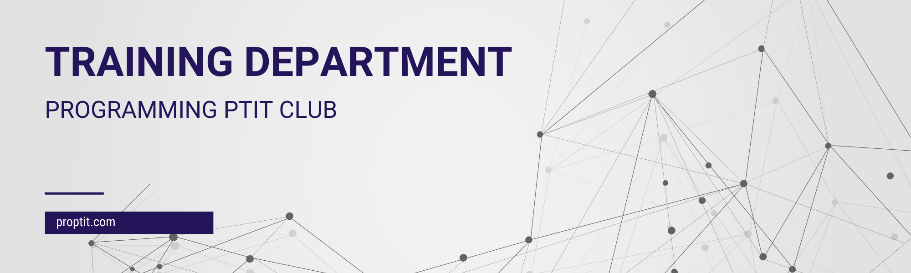

# Introduction

Programming PTIT (ProPTIT) Club is a dynamic professional environment. Members could participate in many programming courses from fundamental (e.g., C, C++, Java) to advanced (e.g., Data structures and algorithms, Games, Mobile apps, Web, Artificial Intelligence).

Technical Training Department have duty to build and improve the learning roadmap, create document for club member. Schedule training for each course, update and improve to match the curriculum on university and actual needs. Also organizing activities and projects to help training soft skill along with technical skill for club member.

More info: [https://proptit.com](https://proptit.com)

## Department members

- Gen 9 (2022 - 2023): 8 members
    - Head of department: Nguyen Quoc Hung [@quochungcyou](https://github.com/quochung-cyou)
    -  Vice Head of department: Nguyen Nam Hai: [@LordierClaw](https://github.com/LordierClaw)
    -  Vice Head of department: Hoang Manh Dung: [@mdunggggg](https://github.com/mdunggggg)
    - Member: Triệu Ngọc Tâm: [@lom123ga](https://github.com/lom123ga)
    - Member: Le Tri Tam: [@TrisTaam](https://github.com/TrisTaam)
    - Member: Vu Dinh Thiet: [@thiet003](https://github.com/thiet003)
    - Member: Nguyen Mai Phuong: [@maiphuong294](https://github.com/maiphuong294)
    - Member: Ngo Dang Han
- Gen 10 (2023 - 2024): 8 members
    - Head of department: Bui The Vinh Nguyen: [@NguyenBui256](https://github.com/NguyenBui256)
    -  Vice Head of department: Nguyen Nhat Thanh: [@NgNhatThanh](https://github.com/NgNhatThanh)
    -  Vice Head of department: Dang Huyen Trang: [@DHuyenTrang](https://github.com/DHuyenTrang)
    - Member: Bui Quang Dat: [@buiquangdat1710](https://github.com/buiquangdat1710)
    - Member: Do Ly Minh Anh: [@minhengdey](https://github.com/minhengdey)
    - Member: Nguyen Huu Tien: [@Hecker-Chuoi](https://github.com/Hecker-Chuoi)
    - Member: Tran Duc Chinh: [@TrDucChinh](https://github.com/TrDucChinh)
    - Member: Pham Quang Minh: [@PhQuangMinh](https://github.com/PhQuangMinh)

